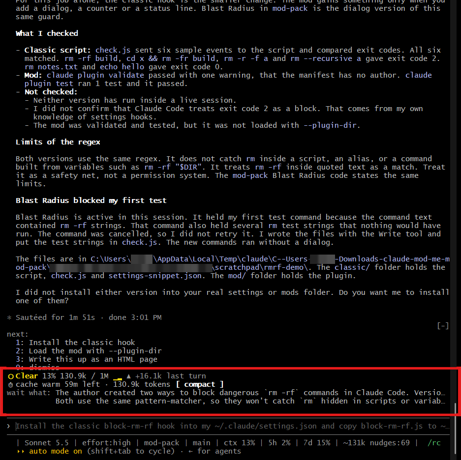
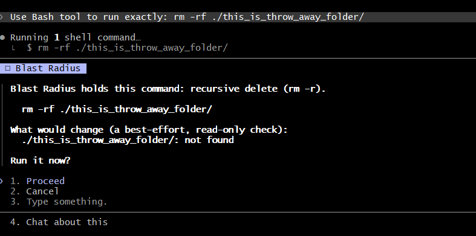
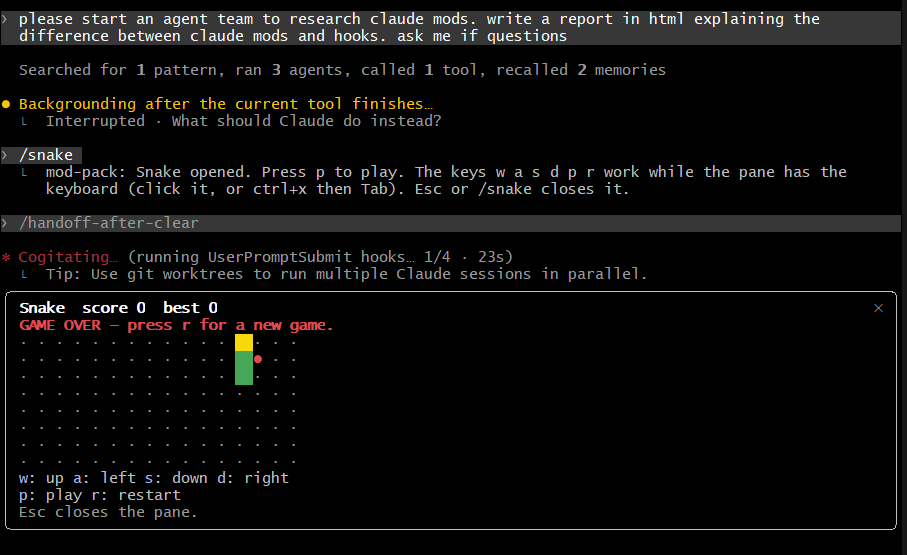
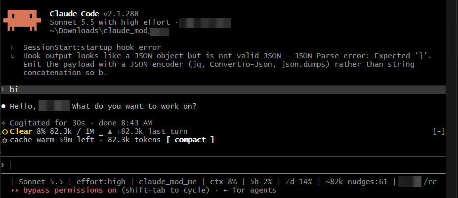

# claude-mod-pack

A mod for Claude Code is a small plugin that draws something inside the terminal UI or reacts to what Claude Code does: a row above the prompt, a pane beside the transcript, a dialog, a toast, a slash command. Mods are written as "function hooks", an early-access plugin API that can change between Claude Code releases. This repository holds `mod-pack`, one plugin with six mods. Each mod has its own on/off switch, set in the plugin settings or with the `/mods` command. The mods that draw above the prompt share that band through one compositor, so they do not overwrite each other or other plugins.

`mod-pack` version 0.1.0 requires Claude Code 2.1.287 or later. The screenshots below were taken with Claude Code 2.1.288 on a Windows terminal.

## Screenshots



Token Weather (the `Clear 13% ...` row), Cache Keeper (the `cache warm 59m left` row with its `compact` button) and Wait What (the two-line retell) in one band above the prompt, with the list from a separate next-steps plugin above them.



The Blast Radius dialog. It holds an `rm -rf` command and asks Run it now? with Proceed and Cancel among the answers. The preview says the folder was not found.



The Snake pane opened with `/snake`, shown in a bordered box. It shows `GAME OVER` with score 0 and best 0.



The band after startup and one short prompt: the Token Weather row and the Cache Keeper row.

Personal details in the screenshots (a user name, an account name, a session id) are covered with solid boxes.

## The six mods

| Mod | What it does | Default | Spends model tokens | Where it draws |
| --- | --- | --- | --- | --- |
| Token Weather | A weather word for how full the context window is (Clear, Cloudy, Showers, Storm, Compact soon), the percent, tokens against the window, a 12-turn chart, and the change since the last turn. | on | no | one row above the prompt |
| Cache Keeper | A countdown of how long the prompt cache stays warm after the last response, the context size, and a `compact` button. A toast appears in the last 5 minutes and a notice when the cache is cold. | on | no, except that the `compact` button runs the same compaction as `/compact` when you press it | one row above the prompt |
| Prompt Queue | `/q <text>` while Claude works stacks follow-up prompts. They are sent one at a time, each when the turn before it ends. | on | no tokens of its own; each queued prompt becomes a normal turn on your plan | one row above the prompt, when the queue is not empty |
| Wait What | After an answer of 200 characters or more, a retell in plain words, at most 2 short lines. | off | yes: each retold answer sends up to 4000 characters to the cheapest model (the `haiku` alias) and reads one short reply back, at most 30 calls an hour by default | up to 2 lines above the prompt |
| Blast Radius | Before Claude runs a risky shell command (`rm -rf`, `git reset --hard`, `git push --force` and similar), it holds the command and asks Proceed or Cancel, with a read-only preview of what would change. | on | no | a question dialog; no band row |
| Snake | `/snake` opens a Snake game in a pane. It pauses when Claude finishes and goes on when you send the next prompt. Keys `w` `a` `s` `d` `p` `r`. Terminal only. | on | no | a pane of its own |

A seventh switch, `sound`, is off by default. It lets mods that can play a sound do so. Token Weather has a thunder sound. Claude Code plays plugin sound only where it has a player, which in the 2.1.287 type declarations is `afplay` on macOS.

## Install

Both routes below were not tested against the public repository. Check them after the repository is public.

From GitHub, as a marketplace. The marketplace is named `claude-mod-pack` and holds one plugin named `mod-pack`:

```
claude plugin marketplace add az9713/claude-mod-pack
claude plugin install mod-pack@claude-mod-pack
```

From a local clone, for one session:

```
git clone https://github.com/az9713/claude-mod-pack
claude --plugin-dir ./claude-mod-pack/mod-pack
```

If you already stand in the clone, the second command is `claude --plugin-dir ./mod-pack`. The first time Claude Code loads the plugin from a folder, it writes type files into `mod-pack/.claude-plugin/types/`. Git ignores that folder.

## Use

| Command | Effect |
| --- | --- |
| `/mods` or `/mods list` | List every mod with ON or OFF, one line about it, and flags for token use and sound. |
| `/mods on <id>`, `/mods off <id>`, `/mods toggle <id>` | Turn one mod on, off, or flip it. The ids are `token-weather`, `cache-keeper`, `prompt-queue`, `wait-what`, `blast-radius` and `snake`. The change applies at once. |
| `/mods sound on`, `/mods sound off` | The global sound switch. |
| `/mods reset` | Drop every choice made with `/mods`, so the plugin settings apply again. |
| `/q <text>` | Queue a follow-up prompt while Claude works (Prompt Queue). |
| `/snake` | Open the Snake pane. Esc or `/snake` closes it. |

A choice made with `/mods` beats the plugin setting and stays until `/mods reset`. The full reference is in [`mod-pack/README.md`](mod-pack/README.md), and a step-by-step test guide is in [`mod-pack/docs/user-guide.html`](mod-pack/docs/user-guide.html).

## How the mods share the screen

1. One compositor owns the only `ui.render` hook for the `AbovePrompt` band. Every mod draws through it.
2. The compositor always calls `next` first and puts the pack's rows below what other plugins drew, so it never hides or reorders them.
3. Each mod returns rows. The band takes at most one third of the available rows, never more than 4, and the rows are filled in a fixed order: Token Weather, Cache Keeper, Prompt Queue, Wait What.
4. A mod puts no digit hotkey on a button, because a digit hotkey also fires when you type that digit into an empty prompt, and the next-steps plugin already uses 0 to 3.
5. Snake draws a pane, not a band row, so it takes no part of the row budget.

## Cost and safety

- Wait What is the only mod that spends model tokens by itself, and it is off by default. Turn it on with `/mods on wait-what` or the `waitWhat` setting. The `maxModelCallsPerHour` setting limits it (default 30, `0` means no calls).
- The Cache Keeper `compact` button runs a compaction, and a compaction spends model tokens when you press it.
- Prompt Queue sends the prompts you queue by itself, when a turn ends, and they run with your permissions.
- Blast Radius reads the text of a command. It does not catch an alias, a script that calls `rm`, a command built from variables such as `rm -rf "$DIR"`, or destructive commands outside its table (`find -delete`, `dd`, `mkfs`). It is a safety net and not a permission system.
- A mod is code that runs with your permissions. Read the code in `mod-pack/hooks/` before you enable it.
- Sound plays only on macOS, and only when the `sound` switch is on.

## Status: what has been seen on a real screen

The automated checks (type check, 367 tests, `claude plugin validate`) run against stubs of the Claude Code engine. The screenshots in this repository are the only evidence from a real terminal.

| Item | Seen on a real terminal | Evidence |
| --- | --- | --- |
| Token Weather row | yes | `images/token-weather.png`, `images/wait-what.png` |
| Cache Keeper row and `compact` button drawn | yes (drawn; the button was not pressed) | `images/token-weather.png`, `images/wait-what.png` |
| Wait What retell | yes | `images/wait-what.png` |
| Blast Radius dialog | yes (the dialog drawn; the screenshot does not show the answer) | `images/blast-radius.png` |
| Snake pane opened and game over shown | yes | `images/snake.png` |
| The band beside a next-steps plugin | yes | `images/wait-what.png` |
| Prompt Queue (`/q`) | not seen | |
| Sound | not seen | |
| Hot reload of the pack | not seen | |
| Install from GitHub (`claude plugin marketplace add`) | not seen | |
| Cache Keeper `compact` button pressed | not seen | |
| Token Weather Storm and Compact soon colours | not seen | |

## Live pages

- [Mods and hooks: what each one is for](https://az9713.github.io/claude-mod-pack/), the report that compares mods with hooks (`docs/index.html`). The page is available after GitHub Pages is switched on for this repository.
- [Claude Code mods field guide](https://az9713.github.io/claude-mod-pack/claude-mods-field-guide.html) (`docs/claude-mods-field-guide.html`).
- [`mod-pack/docs/user-guide.html`](mod-pack/docs/user-guide.html) and [`mod-pack/README.md`](mod-pack/README.md) in this repository.

## Development

Run these from the repository root:

```
claude plugin test mod-pack
claude plugin validate mod-pack/.claude-plugin/plugin.json
claude plugin validate .
npx tsc -p mod-pack
```

`claude plugin validate .` at the root checks the marketplace file `.claude-plugin/marketplace.json`. `npx tsc -p mod-pack` needs the type files in `mod-pack/.claude-plugin/types/`, which Claude Code writes when it loads the plugin from a folder; the folder is git-ignored. The file layout of the plugin is described in `mod-pack/README.md`.

## License

MIT. See [`mod-pack/LICENSE`](mod-pack/LICENSE).
